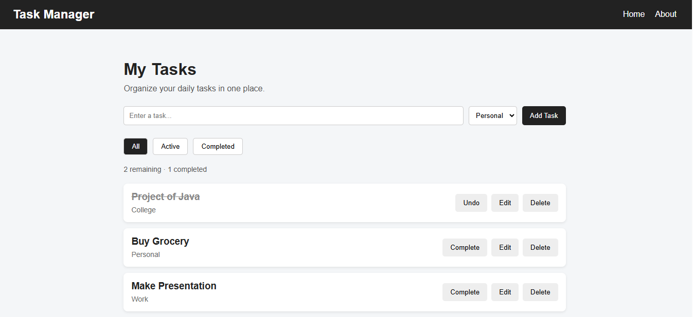
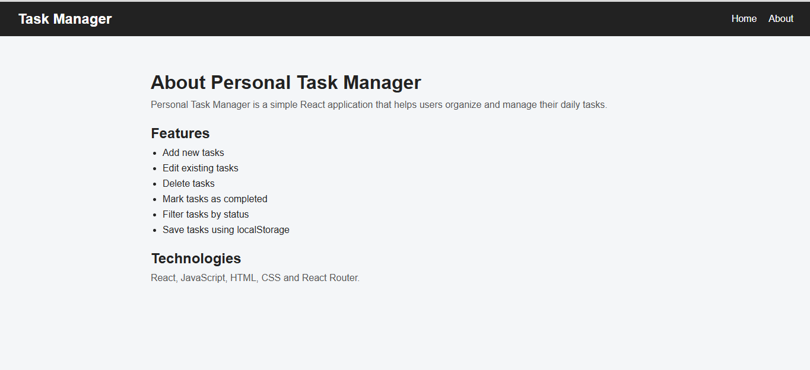
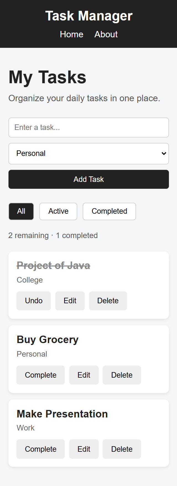

# Personal Task Manager

Personal Task Manager is a simple React application that helps users organize and manage their daily tasks. Users can add, edit, delete, complete, and filter tasks according to their status and category.

## Features

- Add new tasks
- Edit existing tasks
- Delete tasks
- Mark tasks as completed
- Undo completed tasks
- Filter tasks by All, Active, and Completed
- Categorize tasks as Personal, College, Work, or Other
- Display remaining and completed task counts
- Save tasks using browser localStorage
- Responsive design for desktop and mobile
- Home and About pages using React Router

## Technologies Used

- React
- JavaScript
- HTML
- CSS
- React Router
- Browser localStorage
- Vite

## Project Structure

```text
src/
├── components/
│   ├── Navbar.jsx
│   ├── TaskForm.jsx
│   ├── TaskFilter.jsx
│   ├── TaskList.jsx
│   └── TaskItem.jsx
├── pages/
│   ├── Home.jsx
│   └── About.jsx
├── App.jsx
├── index.css
└── main.jsx
```
## How to Run the Project

### 1. Install Dependencies

Open the project folder in VS Code and run:
```bash
npm install
```

### 2. Start the Development Server

Run:
```bash
npm run dev
```
### 3. Open the Application

Open the local URL shown in the terminal in your web browser.

## Screenshots

### 1. Home Page



### 2. About Page



### 3. Mobile Responsive View



## Limitations
- Tasks are stored only in the browser's localStorage.
- Tasks are not synchronized between different devices.
- The application does not have user login or an online database.
- Clearing browser storage will remove the saved tasks.

### Repositories Link
https://github.com/sagunashrestha00-svg/Personal-Task-Manager